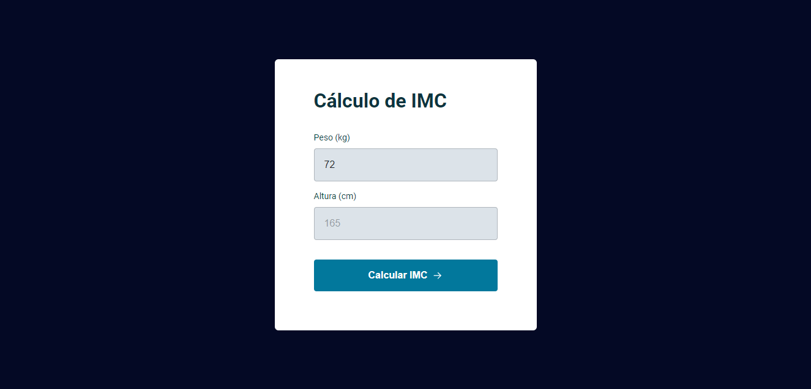
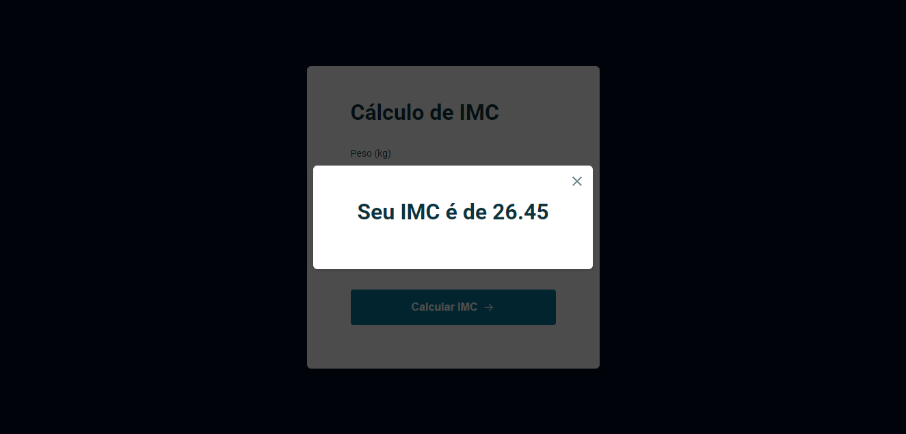

<h1 align="center">Calculadora de IMC</h1>

[Projeto](#projeto) &nbsp;&nbsp;&nbsp;|&nbsp;&nbsp;&nbsp; [Tecnologias](#tecnologias)
&nbsp;&nbsp;&nbsp;|&nbsp;&nbsp;&nbsp; [Layout](#layout) &nbsp;&nbsp;&nbsp;|&nbsp;&nbsp;&nbsp;
[Licença](#license)

  

 

 
 

## 💻 Projeto 

Esse projeto foi desenvolvido durante o 2° Módulo do Stage 5, do Explorer, curso da Rocketseat,
sendo um dos projetos feito em aula.

Foi abordado e utilizado nesse projeto, conhecimentos de formulário, inputs, estruturação e
modularização de dados e arquivos, programação orientação a eventos, um pouco sobre o ES6, imports e
exports, functions, eventos, manipulação de listas de classes de um elemento, entre outras coisas.

Esse projeto é uma calculadora de IMC básica, que mostra o resultado em um modal e caso a entrada de
dados seja inválida, apresenta também mensagens de erro, conforme as imagens.

 

 
 

## 🚀 Tecnologias 

- HTML
- CSS
- JavaScript

 
 

## 🔖 Layout 

Você pode visualizar o layout do projeto através
[DESSE LINK](<https://www.figma.com/file/3sFMrfdgoRtFguu56Vy4JF/IMC-(Copy)?type=design&node-id=6%3A5&mode=design&t=TssdRJ3FxDyeeLMh-1>).
É necessário ter conta no [Figma](https://figma.com) para acessá-lo .

 
 

## 🔒 Licença

Esse projeto está sob a licença MIT.

