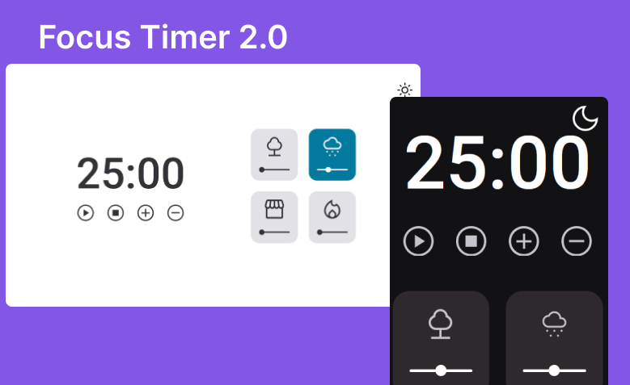

<h1 align="center">Focus Timer</h1>

  <a href="#-tecnologias">Tecnologias</a>&nbsp;&nbsp;&nbsp;|&nbsp;&nbsp;&nbsp;
  <a href="#-projeto">Projeto</a>&nbsp;&nbsp;&nbsp;|&nbsp;&nbsp;&nbsp;
  <a href="#-layout">Layout</a>

 

  

## 🚀 Tecnologias

Esse projeto foi desenvolvido com as seguintes tecnologias:

- Javascript
- HTML e CSS
- Git e Github

## 💻 Projeto

Este projeto foi desenvolvido como desafio do Stage 05: Avançando com JavaScript, do curso Explorer da Rocketseat. O desafio foi dividido em duas partes, a primeira sendo a criação do timer, controles e cards de som; e a segunda sendo a criação de tema dark mode, e controle de volume dos sons de cada card.
Este projeto aplica diversos conhecimentos de JavaScript, como:

- import/export (ES6 Modules)
- Design Pattern: Factory
- manipulação de DOM
- Injeção de dependências
- Event Listeners
- métodos: setTimeout() e clearTimeout(), padStart(), padEnd()
- Construtor: Audio()

Além de inúmeros conhecimentos de HTML e CSS.

### Features deste projeto:

- Iniciar uma contagem regressiva
- Parar o temporizador
- Adicionar ou remover tempo no temporizador
- Adicionar diferentes sons ambientes através dos cards
- Controlar o volume dos sons de cada card
- Notificação por som quando o temporizador chegar ao fim do tempo estipulado
- Tema light e dark, com botão toggle para escolha entre temas
- Versão mobile e desktop

Você pode visualizar o projeto através [DESSE LINK](https://viviansanchez.github.io/rocketseat-explorer-stage05-desafio02e03/)!

## 🔖 Layout

Você pode visualizar o desafio 01 através [DESTE LINK](https://efficient-sloth-d85.notion.site/FocusTimer-Vers-o-2-0-2e273fa9212a432eae6b51dda3c69594) e o respectivo layout do Figma [NESTE LINK](https://www.figma.com/file/Pw8yMsK7HFkD6aISZt6gPA/Stage-05---Focus-Timer-2.0/duplicate).

E você pode visualizar o desafio 02 através [DESTE LINK](https://efficient-sloth-d85.notion.site/FocusTimer-Dark-Mode-df7a74c5bcb745a0be5428897eb79b3e) e o respectivo layout do Figma [NESTE LINK](https://www.figma.com/file/nlJJAVuGDc1tnDKqUW4FJA/Stage-05---Dark-Mode-FocusTimer/duplicate).
