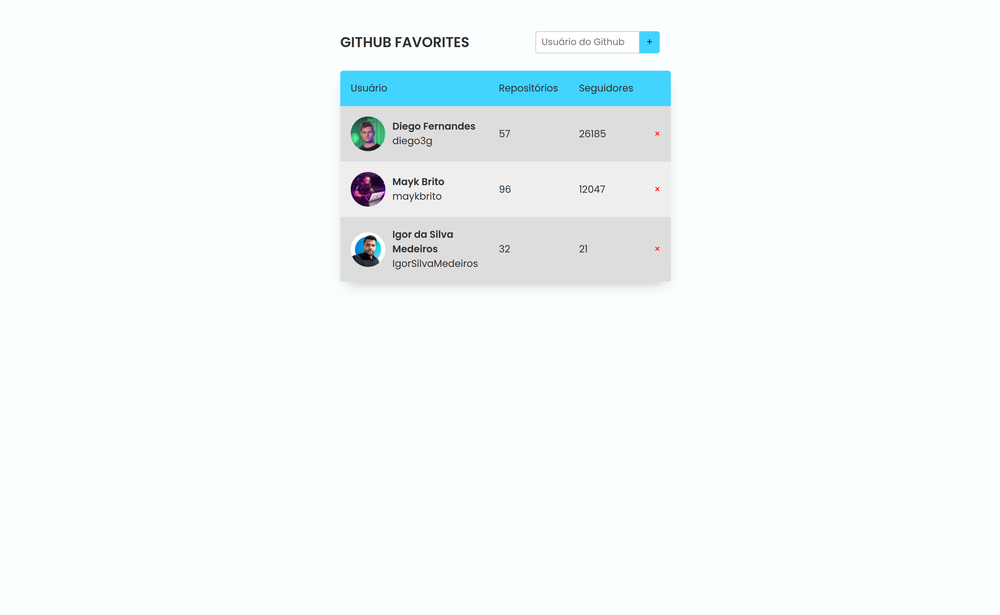

<h1 align="center">
	GitHub Favorites
</h1>

<h3 align="center">
	Project for add GitHub favorites 
</h3>

<h4 align="center">
	Status: 🚀 Finished
</h4>

	<a href="#about">About</a> •
	<a href="#tech-stack">Tech Stack</a> •
	<a href="#usage">Usage</a> • 
	<a href="#contact">Contact</a> 

  

## About

EN = This project aims to put into practice JavaScript, HTML and CSS, where a page was created to add your favorite GitHub profiles, in addition to saving the data in the localStorage of the browser, it was elaborated in the class of Rocketseat's Explorer program.

PT = Esse projeto tem como finalidade colocar em prática JavaScript, HTML e CSS, onde foi criado uma página para adicionar os seus perfis favoritos do GitHub, além de ele salvar no localStorage do navegador os dados , ele foi elaborado na aula do programa Explorer da Rocketseat.

## Tech Stack

<a href="https://developer.mozilla.org/pt-BR/docs/Web/CSS" target="_blank">&nbsp;</a>
<a href="https://developer.mozilla.org/pt-BR/docs/Web/HTML" target="_blank">&nbsp;</a>
<a href="https://developer.mozilla.org/pt-BR/docs/Web/JavaScript" target="_blank">&nbsp;</a>

## Usage

To use this project, go to the link:

[Link Project](https://igorsilvam.github.io/Github-favorites/)

## Contact

Made with ❤️ by [Igor Silva](https://github.com/igorsilvam), get in touch!

&nbsp;
&nbsp;

 
